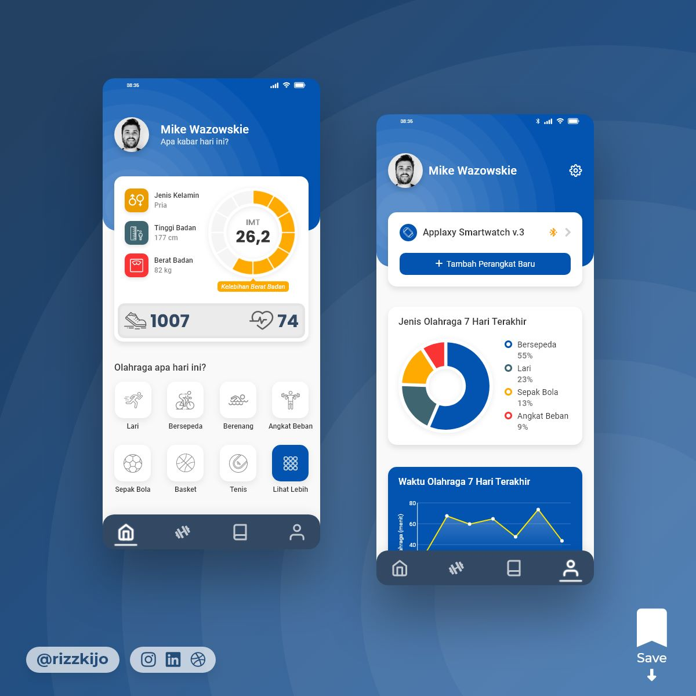
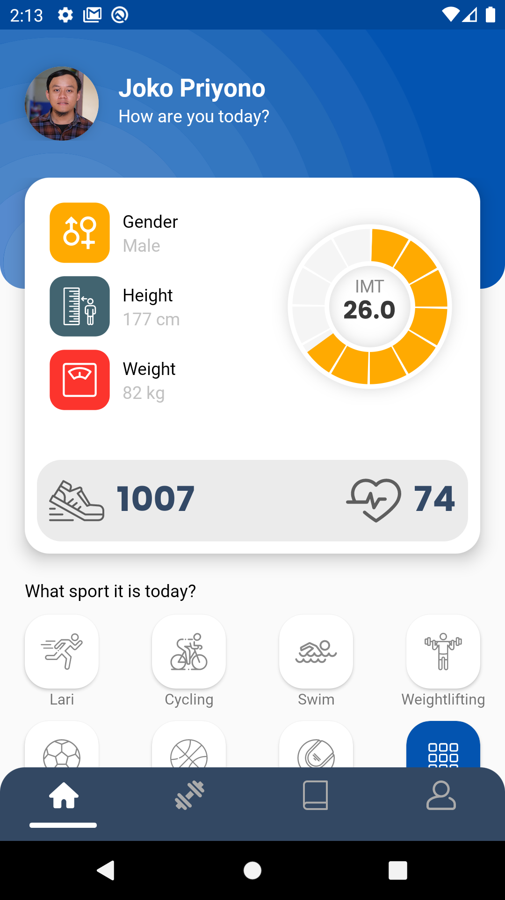
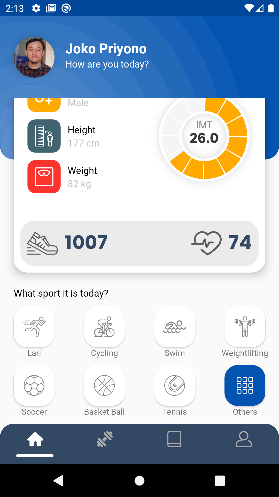
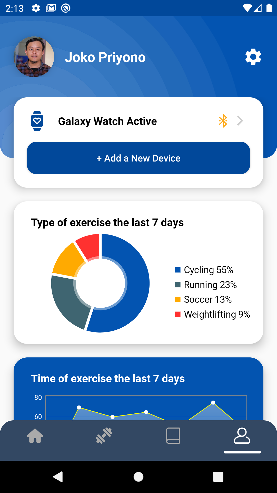
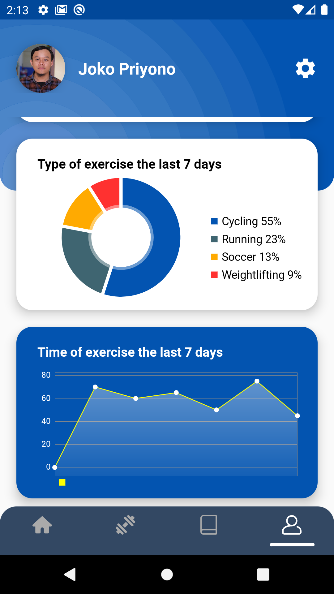

# Freelan!

This is a free XML template for Android, please also check awesome UI/UX from [Rizki](https://www.instagram.com/rizzkijo/) Instagram account.

This project builds pure using Kotlin language ❤ | Also get ultimate awesome icon from [Flaticon](https://www.flaticon.com/) ❤

## Screenshots

| Fragment |UI                                   |                                     |
|----------|-------------------------------------|-------------------------------------|
|Home      |||
|Profile   |||

## Thank you for awesome MPAndroidChart
[MPAndroidChart](https://github.com/PhilJay/MPAndroidChart) ❤❤❤